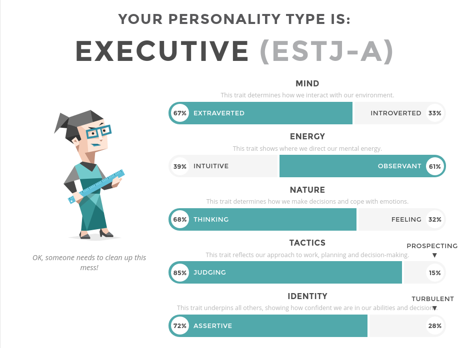

# Section 1: Interest in IT

My interest in IT began in earnest after completing high-school. At the time I had wanted to become a history teacher but after a school friend started his own computer repair business I found my interest growing. After 6 months of studying teaching in 2003, I changed my degree to computer science. At the same time, I began volunteering at RFLAN and found a part time gig supporting a Linux system for an Internet cafe.

Being at a young age where I didn’t really know what I wanted, I ended up dropping out and finding work in the WA Goldfields during the mining boom, working on drilling rigs and eventually starting a trainee-ship as a heavy diesel mechanic.

Again, finding that the life of a tradesman wasn’t my cup-of-tea, I ended up going back to (a different) university and completing a BA in history, before going on to complete a graduate diploma of education (secondary). As the universe clearly has a sense of humour, I found that I hated working in education quit teaching after about 2.5 years, enrolled in TAFE and completed my certificate III in IT. 

From there I landed my first ‘real’ IT job as a level 1 remote desktop support technician for a managed services provider. Never having lost my interest in computers and keeping relatively up to date with technology over the years paid off and I was promoted to L2 within a 12 months. I also discovered that my Linux administration skills were relatively rare in a world dominated by Microsoft and was able to leverage them to land my current positionat Curtin University which I’ve held for two years, where I provide academics and researchers specialised Linux desktop support.

I chose to study with RMIT via Open University as many positions that I am interested in require formal tertiary qualifications in computer science or IT. RMIT seems to be the only provider that offers a fully online degree in IT, not computer science, which I consider to be too theoretical to be of any use. I expect to learn more programming languages and use thos skills to build automation and integration tools which will help me to get a job in systems administration or DevOps.

# Section 2: Ideal Job

# Section 3: Personal Profile

# Section 4: Project Idea