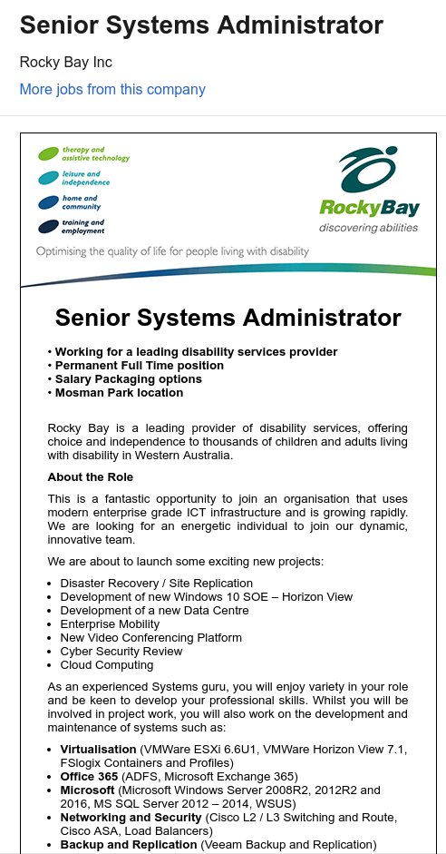
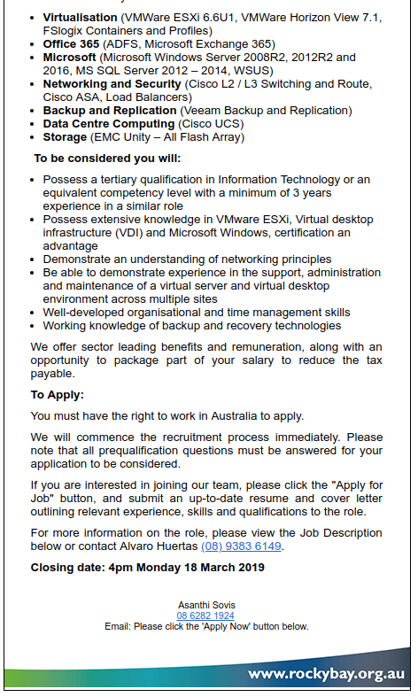

## Senior Systems Administrator

### About the Role

This is a fantastic opportunity to join an organisation that uses modern enterprise grade ICT infrastructure and is growing rapidly. We are looking for an energetic individual to join our dynamic, innovative team.

### We are about to launch some exciting new projects:

* Disaster Recovery / Site Replication
* Development of new Windows 10 SOE – Horizon View
* Development of a new Data Centre
* Enterprise Mobility
* New Video Conferencing Platform
* Cyber Security Review
* loud Computing

### As an experienced Systems guru, you will enjoy variety in your role and be keen to develop your professional skills. Whilst you will be involved in project work, you will also work on the development and maintenance of systems such as:

* Virtualisation (VMWare ESXi 6.6U1, VMWare Horizon View 7.1, FSlogix Containers and Profiles)
* Office 365 (ADFS, Microsoft Exchange 365)
* Microsoft (Microsoft Windows Server 2008R2, 2012R2 and 2016, MS SQL Server 2012 – 2014, WSUS)
* Networking and Security (Cisco L2 / L3 Switching and Route, Cisco ASA, Load Balancers)
* Backup and Replication (Veeam Backup and Replication)
* Data Centre Computing (Cisco UCS)
* Storage (EMC Unity – All Flash Array)

### To be considered you will:

* Possess a tertiary qualification in Information Technology or an equivalent competency level with a minimum of 3 years experience in a similar role
* Possess extensive knowledge in VMware ESXi, Virtual desktop infrastructure (VDI) and Microsoft Windows, certification an advantage
* Demonstrate an understanding of networking principles
* Be able to demonstrate experience in the support, administration and maintenance of a virtual server and virtual desktop environment across multiple sites
* Well-developed organisational and time management skills
* Working knowledge of backup and recovery technologies

