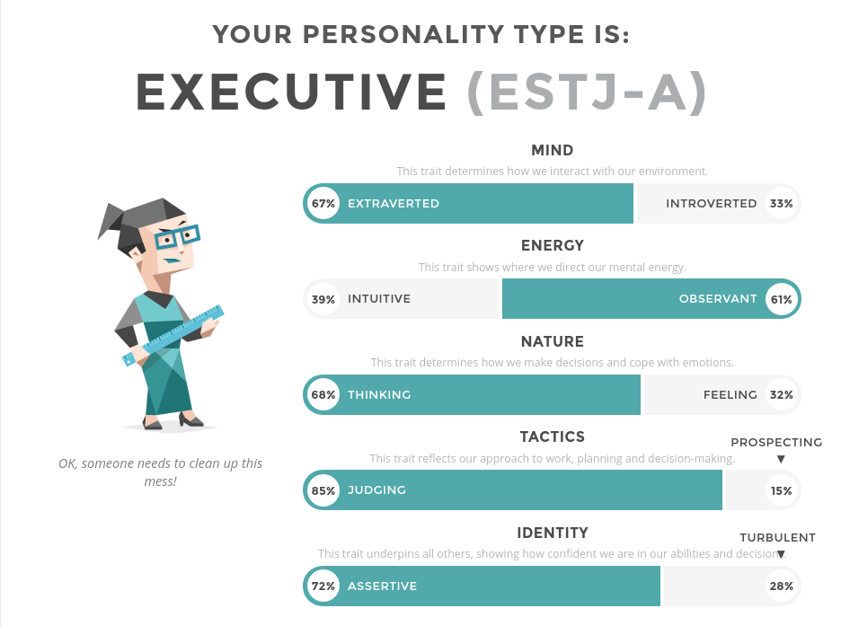

# Section 3: Personal Profile

## Test 1 - Myers-Briggs Type Indicator (MBTI)

[Source: 16Personalities Test](https://www.16personalities.com/estj-personality)

### Result: Type A, Executive

## Test 2: Learning Styles Test

[Source: Education Planner](http://www.educationplanner.org/students/self-assessments/learning-styles-results.shtml?event=results&A=7&V=11&T=2)

### Result: Visual Learner

## Big 5 Personality Test
[Source: Open Psychometrics](https://openpsychometrics.org/tests/IPIP-BFFM/results.php?r=3.9,3.2,2.9,4.7,4.5#_V)

### Results:

## Discussion:

### Guiding Questions:

* What do the results of these tests mean for you?
* How do you think these results may influence your behaviour in a team?
* How should you take this into account when forming a team?

These tests don't reveal much that I didn't already know about myself. I am a critical thinker (low agreeableness) and I demand a high burden of proof before I will accept a new idea as 'correct' or better than a previously held belief. For this I blame all the philosophy units I did during my first undergraduate degree. I do enjoy new ideas and I am open to new knowledge and experience (high intellect/imagination, aka openness), however as stated, this does not mean I accept them. I'm relatively emotionally stable and despite my critical nature I am conscientious and look out for others.

Because of my traits, I think I'm ideally suited to work in a team environment. I'm keenly aware of how other people are feeling and work to bring others together. I have high expectations of my teammates and of their work. In this regard at least, I believe the MBTI is correct, I am a natural 'executive' type. I also believe these traits helped me to be a good teacher and technical support technician. I don't mind spending time explaining my position, or a technical issues to team members or other staff members. 

The only other point I could make is about learning styles, and how they are usually incorrectly used. Having a preference for a learning style, in my case 'visual' does not mean I should focus on learning everything visually. Depending on the subject or skill being taught a different method might be more appropriate to use to communicate the skills or knowledge. For instance reading a description on how to draw a population pyramid would not be as effective as a demonstration of the skill. This does not mean reading a description of the process to someone who has a auditory learning style and a video demonstration to a visual learner. It means helping the auditory learner improve their visual learning skills or vice-versa as the case may be.

| [Section 1: Interest in IT](../section1/section1.html) | [Section 2: Ideal Job](../section2/section2.html) | Section 3: Personal Profile | [Section 4: Project Idea](../section4/section4.html) |